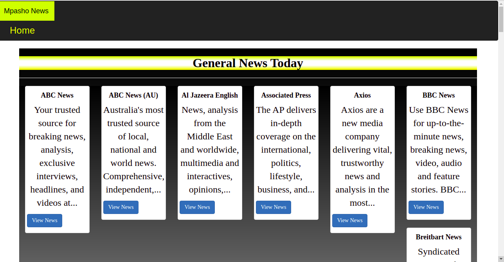

# MpashoNews
An application that allows users to list and preview news articles from various sources all around the world
#### BY: MAXWELL MUNENE

## Description
* The application consumes the [NewsAPI](https://newsapi.org/) hence the application provides the following functionalities to users:
* View top stories. These are displayed on the landing page in carousel form. Each carousel item has a clickable link that allows the user to read the top story's article.
* Have access to news sources. The user has access to over 50 news sources of various categories. These are displayed on the landing page in card format for each news source.
* Search for articles from all around the world. The user can search for an article by keyword.

## Live link

## Development
To make advancements/modifications, follow these steps:

* Clone the repository
* Cd to Folder 

## Technologies Used
Technologies used to develop this application:

1. Python v3
2. Flask 1.1.2
3. Flask-Bootstrap
4. HTML 
5. CSS

## Support and contact details

Should you be unable to access the website, have any recommendations and/or questions, feel free to email me:[maxwell.munene@student.moringaschool.com]

## License.
{MIT License

Copyright (c) 2021

Permission is hereby granted, free of charge, to any person obtaining a copy of this software and associated documentation files (the "Software"), to deal in the Software without restriction, including without limitation the rights to use, copy, modify, merge, publish, distribute, sublicense, and/or sell copies of the Software, and to permit persons to whom the Software is furnished to do so, subject to the following conditions:

The above copyright notice and this permission notice shall be included in all copies or substantial portions of the Software.

THE SOFTWARE IS PROVIDED "AS IS", WITHOUT WARRANTY OF ANY KIND, EXPRESS OR IMPLIED, INCLUDING BUT NOT LIMITED TO THE WARRANTIES OF MERCHANTABILITY, FITNESS FOR A PARTICULAR PURPOSE AND NONINFRINGEMENT. IN NO EVENT SHALL THE AUTHORS OR COPYRIGHT HOLDERS BE LIABLE FOR ANY CLAIM, DAMAGES OR OTHER LIABILITY, WHETHER IN AN ACTION OF CONTRACT, TORT OR OTHERWISE, ARISING FROM, OUT OF OR IN CONNECTION WITH THE SOFTWARE OR THE USE OR OTHER DEALINGS IN THE SOFTWARE. } Copyright (c) {2021} {Maxwell Munene}

